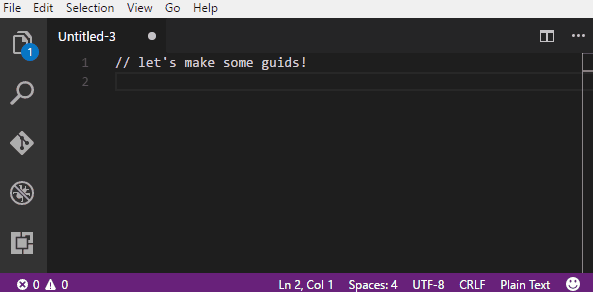

# CodeGuid README

Welcome to CodeGuid! It's a simple extension to VS Code that allows access to a simple GUID generator for development.

> **THE MOST IMPORTANT OF NOTES**: GUIDs are fun, cool, and hip, and they come up a lot (for me, at least) in testing and prototyping. However, the actual generation of real-live GUIDs is one of those computer-sciency things, I'm pretty sure. The method I'm using to generate GUIDs is really simple and not cryptographically secure, so don't use these for anything other than development. Go forth and CodeGuid!

## Features

- Easy generation/copying of GUIDs via the Command Palette: 

- Customizable keybindings for same (the "insert" command is bound by default to CTRL+SHIFT+G, CTRL+SHIFT+G or CMD+^+G CMD+^+G,CMD+^+G on Mac)
- The option to turn off the probably-annoying notification that happens when the guid is generated using the config flag `codeGuid.showNotificationWhenGuidGenerated`

## Known Issues

I'm using [copy-paste](https://github.com/xavi-/node-copy-paste) to deliver clipboard access. It doesn't seem to have an error callback if something goes wrong. Maybe it never will? I have absolute faith in [xavi](https://github.com/xavi-), whoever that blessed soul is.

## Release Notes

### 1.3.1

Update README.

### 1.3.0

Dependency updates to resolve potential vulnerabilities.

### 1.2.4
Updated README.

### 1.2.3

Updated my package-lock to remove references to event-stream and flatmap-stream due to the large kerfuffle going on [here](https://github.com/dominictarr/event-stream/issues/116). I'm not using these dependencies anyway - I think they were created by an old version of the VS Code Extension Yeoman generator. Also did general code cleanup and updated some configuration files to the modern age of VS Code.

### 1.2.1

Updated README.

### 1.2.0

Change the default keybinding for "Insert GUID at Cursor" to `ctrl`+`;` because the original keybinding (`ctrl`+`g`, `ctrl`+`g`) conflicts with the keybinding for "Show SCM".

### 1.0.1

Added a new command that inserts a generated GUID at the cursor location in the active text editor and rebound the default keybinding to it (since this command is basically Lorelai, and the old one is more or less Kirk).

### 0.9.2

CodeGuid is born!